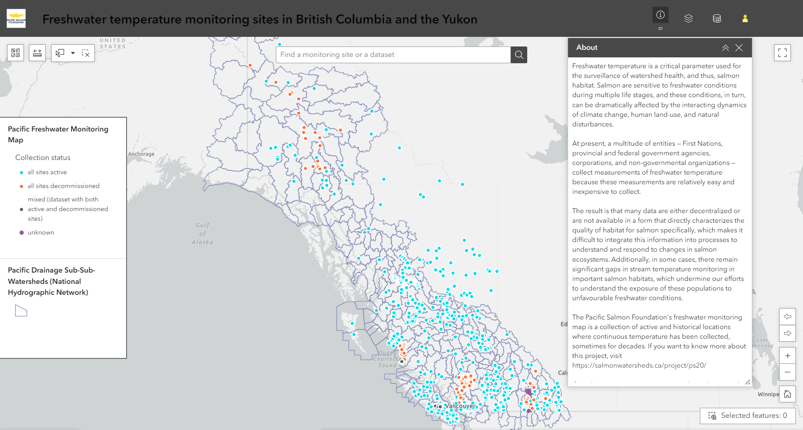

# Freshwater Monitoring Catalogue

The SWP's freshwater monitoring map (or catalogue) is a collection of active and historical locations (1164 to date) where continuous temperature has been collected, sometimes for decades. If you want to know more about this project, visit https://salmonwatersheds.ca/project/ps20/

This repository contains the code to generate the monitoring site layer in the ArcGIS Online application "Freshwater temperature monitoring sites in British-Columbia and the Yukon". The code is being developed in such a way that—as much as possible—there is no need to download external data.To do so, the code relies on various packages providing access to distant databases, mostly through APIs.

This work is developed under the Pacific Salmon Foundation's Resilient Salmon Project funded by the [British Columbia Salmon Conservation and Innovation Fund](https://www.dfo-mpo.gc.ca/fisheries-peches/initiatives/fish-fund-bc-fonds-peche-cb/index-eng.html).

# Navigating the catalogue
The freshwater monitoring catalogue is built out of ESRI ArcGIS Experience components, which makes the application intuitive to use. The application is meant to be simple with basic search, selection, and download capacities. A short tutorial is provided below.

If you notice problems, would like to contribute data, or need more guidance on using the catalogue, please reach out to François-Nicolas Robinne (frobinne@psf.ca).

## The interface

## About and personalization

- The About button provides the user with more details about the project, as well as the possibility to access more information online on the [Pacific Salmon Foundation's website](https://psf.ca/).
- The Layers button shows a list of pre-loaded layers available for display on the map (e.g., Conservation Units).
- 

## Search bar

(Picture of the search bar)

## Measurements and dynamic selection

## Attribute table
