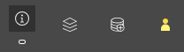

# Freshwater Monitoring Catalogue

The SWP's freshwater monitoring map (or catalogue) is a collection of active and historical locations (1164 to date) where continuous temperature has been collected, sometimes for decades. If you want to know more about this project, visit <https://salmonwatersheds.ca/project/ps20/>

This repository contains the code to generate the monitoring site layer in the ArcGIS Online application "Freshwater temperature monitoring sites in British-Columbia and the Yukon". The code is being developed in such a way that---as much as possible---there is no need to download external data.To do so, the code relies on various packages providing access to distant databases, mostly through APIs.

This work is developed under the Pacific Salmon Foundation's Resilient Salmon Project funded by the [British Columbia Salmon Conservation and Innovation Fund](https://www.dfo-mpo.gc.ca/fisheries-peches/initiatives/fish-fund-bc-fonds-peche-cb/index-eng.html).

# Navigating the catalogue

The freshwater monitoring catalogue is built out of ESRI ArcGIS Experience components, which makes the application intuitive to use. The application is meant to be simple with basic search, selection, and download capacities. A short tutorial is provided below.

If you notice problems, would like to contribute data, or need more guidance on using the catalogue, please reach out to François-Nicolas Robinne ([frobinne\@psf.ca](mailto:frobinne@psf.ca){.email}).

## The interface

## About and personalization

-   The About button provides the user with more details about the project, as well as the possibility to access more information online on the [Pacific Salmon Foundation's website](https://psf.ca/).
-   The Layers button shows a list of pre-loaded layers available for display on the map (e.g., Conservation Units).
-   The Add data button allows the user to add new data to the map by uploading a physical file or using a URL pointing to an online file.
- Data providers displays a list of the organizations that have contributed data and support to this project.

## Search bar

The search bar allows the user to look for a monitoring site or a monitoring dataset based on the fields present in the attribute table (and accessible manually to the user through a folding panel at the bottom of the map). The attribute fields that are searchable are:

- the monitoring site name (as provided by the data owner).
- the monitoring site unique ID (as provided by the data owner or as created by PSF).
- the name of the dataset (as provided by the data owner).
- the organization that provided the dataset.
- the type of organization that provided a dataset (e.g. NGO, goverment).
- the type of water body (e.g., stream, lake, wetland).

## Measurements and dynamic selection

- By clicking on the Measure button, the user can take simple measurements for lines and polygons in the unit of their choice (e.g., metric, imperial).
- The Selection tool allows the user to dynamically select features on the main map using various capture shapes (e.g., rectangle, line, circle). The resulting selection will be highlighted in the map window and in the attribute table as well.

## Attribute table

The attributes of the data points available in the catalog are accessible through the attribute table. The table is hidden by default as a folding window at the bottom of the map. 

If the user has selected points on the map already, those will be highlighted in the table, and non-selected records can be filtered out for convenience. Points can also be selected in the attribute table and be zoomed in to.

The attribute table window provides other useful tools for the user to filter attributes, to hide columns, to compute statistics on a field, and to export either a selection of the whole dataset.

Alternatively, the user can access a point's attributes by directly clicking a point on the map. A popup (below) will appear, showing the same elements as in the attribute table. Using the options provided by the popup, the user can view the point in the attribute table, as well as export the point for use in another application.

